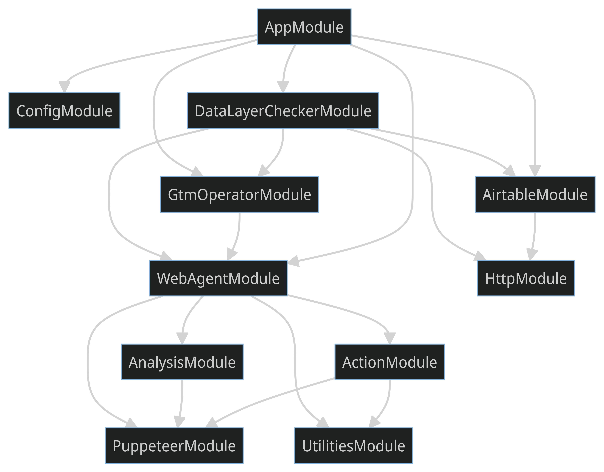

## Overview

A [Nest](https://github.com/nestjs/nest) application, a progressive Node.js framework that provides a simple and efficient way to interact with the dataLayer on websites. The goal of this application is to make it easier to keep track of dataLayer.

## Installation

```bash
$ npm install
```

## Running the app

```bash
# development
$ npm run start

# watch mode
$ npm run start:dev

# production mode
$ npm run start:prod
```

## Test

```bash
# unit tests
$ npm run test

# e2e tests
$ npm run test:e2e

# test coverage
$ npm run test:cov
```

## Dependencies


